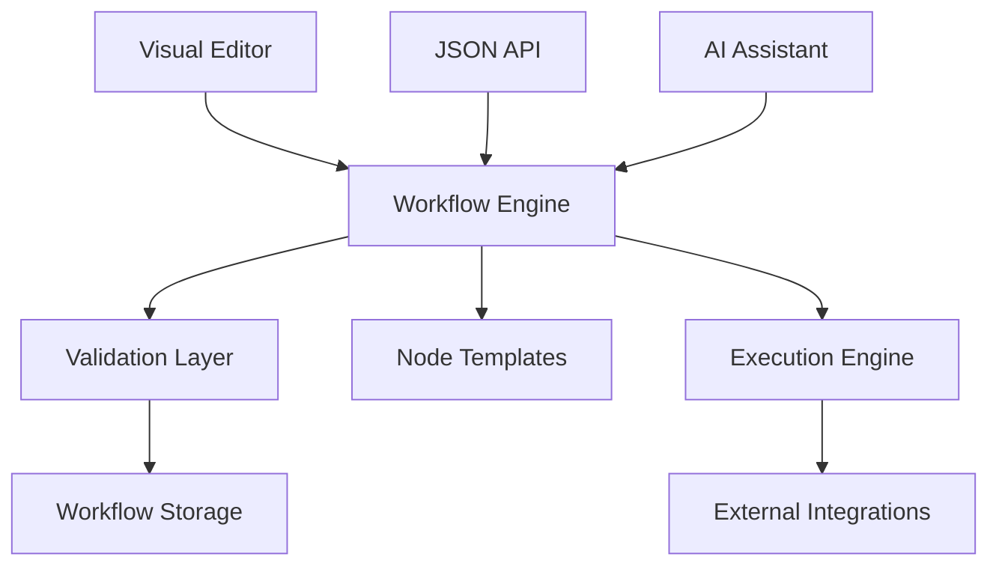

# Getting Started with FlowMind AI - JSON Workflow System

## Table of Contents
1. [Introduction](#introduction)
2. [System Architecture](#system-architecture)
3. [JSON Schema Overview](#json-schema-overview)
4. [Creating Workflows via JSON](#creating-workflows-via-json)
5. [Node Types & Configuration](#node-types--configuration)
6. [Connection System](#connection-system)
7. [Import/Export Operations](#importexport-operations)
8. [AI-Driven Workflow Generation](#ai-driven-workflow-generation)
9. [API Reference](#api-reference)
10. [Best Practices](#best-practices)
11. [Examples](#examples)
12. [Troubleshooting](#troubleshooting)

---

## Introduction

FlowMind AI is an enterprise-grade workflow automation platform that enables you to create, manage, and execute complex business processes through a powerful JSON-based engine. This system supports:

- **Visual workflow creation** through drag-and-drop interface
- **JSON-based workflow definition** for programmatic creation
- **AI-driven workflow generation** via natural language
- **Enterprise-scale validation** and error handling
- **Real-time execution** with monitoring and analytics

### Key Benefits

✅ **No-Code & Code-Friendly** - Visual interface + JSON API  
✅ **Enterprise Security** - SOC 2 compliant with end-to-end encryption  
✅ **Scalable Architecture** - Handle millions of executions  
✅ **AI Integration** - Generate workflows via chat interface  
✅ **500+ Integrations** - Connect with popular enterprise tools  

---

## System Architecture

### Core Components



### Technology Stack

- **Frontend**: Next.js 15, React 19, TypeScript, Tailwind CSS
- **Validation**: Zod schemas with enterprise-grade type safety
- **Engine**: Node.js with comprehensive error handling
- **Storage**: JSON-based with checksum integrity
- **AI**: Integration ready for workflow generation

---

## JSON Schema Overview

FlowMind AI uses a structured JSON schema (`flowmindai-workflow-v1`) that ensures consistency, validation, and compatibility across all workflow operations.

### Basic Workflow Structure

```json
{
  "version": "1.0.0",
  "schema": "flowmindai-workflow-v1",
  "exportedAt": "2025-01-06T10:00:00.000Z",
  "exportedBy": "user@company.com",
  "checksum": "sha256-hash-for-integrity",
  "workflow": {
    "id": "550e8400-e29b-41d4-a716-446655440000",
    "name": "Customer Onboarding Process",
    "description": "Automated customer welcome and profile setup",
    "status": "active",
    "nodes": [...],
    "connections": [...],
    "settings": {...},
    "metadata": {...}
  }
}
```

### Schema Validation Layers

1. **Structure Validation** - JSON format and required fields
2. **Type Validation** - Node types, connection types, data types
3. **Business Logic Validation** - Workflow integrity, node configuration
4. **Security Validation** - Input sanitization, access control

---

## Creating Workflows via JSON

### Method 1: Complete JSON Definition

Create a full workflow with all properties defined:

```json
{
  "version": "1.0.0",
  "schema": "flowmindai-workflow-v1",
  "workflow": {
    "id": "workflow-uuid",
    "name": "API Data Processing",
    "description": "Fetch, process, and store API data daily",
    "nodes": [
      {
        "id": "node-1",
        "type": "schedule",
        "category": "trigger",
        "name": "Daily Trigger",
        "position": { "x": 100, "y": 100 },
        "config": {
          "type": "cron",
          "cron": "0 2 * * *",
          "timezone": "UTC"
        }
      },
      {
        "id": "node-2",
        "type": "http_request",
        "category": "action",
        "name": "Fetch Data",
        "position": { "x": 400, "y": 100 },
        "config": {
          "method": "GET",
          "url": "https://api.example.com/data",
          "headers": {
            "Authorization": "Bearer {{env.API_TOKEN}}"
          },
          "timeout": 30000
        }
      }
    ],
    "connections": [
      {
        "id": "conn-1",
        "sourceNodeId": "node-1",
        "sourcePortId": "output",
        "targetNodeId": "node-2",
        "targetPortId": "input",
        "type": "default"
      }
    ],
    "settings": {
      "timeout": 300000,
      "retryCount": 3,
      "errorHandling": "stop"
    },
    "variables": {
      "api_endpoint": "https://api.example.com"
    }
  }
}
```

### Method 2: Simplified JSON Format

Use our simplified format for easier workflow creation:

```json
{
  "name": "Simple Customer Onboarding",
  "description": "Basic onboarding workflow",
  "nodes": [
    {
      "type": "http_webhook",
      "name": "Customer Signup",
      "position": { "x": 100, "y": 100 },
      "config": {
        "path": "/webhook/signup",
        "methods": ["POST"]
      }
    },
    {
      "type": "email_send",
      "name": "Welcome Email",
      "position": { "x": 400, "y": 100 },
      "config": {
        "to": ["{{input.email}}"],
        "subject": "Welcome!",
        "body": "Thank you for joining us!"
      }
    }
  ],
  "connections": [
    {
      "from": "Customer Signup",
      "to": "Welcome Email"
    }
  ]
}
```

### Method 3: Programmatic Creation

```typescript
import { workflowEngine, WorkflowJSONUtils } from '@/lib/workflow';

// Create workflow via engine
const workflow = await workflowEngine.createWorkflow({
  workflow: {
    name: 'Dynamic Workflow',
    description: 'Created programmatically',
    nodes: [],
    connections: [],
    settings: {},
    variables: {},
    triggers: []
  }
});

// Add nodes
await workflowEngine.addNode({
  workflowId: workflow.id,
  node: {
    type: 'http_webhook',
    category: 'trigger',
    name: 'API Trigger',
    position: { x: 100, y: 100 },
    config: { path: '/api/trigger' }
  }
});

// Export to JSON
const jsonString = await WorkflowJSONUtils.exportToJSON(workflow.id, {
  prettify: true,
  exportedBy: 'system'
});
```

---

## Node Types & Configuration

### Trigger Nodes

Trigger nodes start workflow execution when specific conditions are met.

#### HTTP Webhook
```json
{
  "type": "http_webhook",
  "config": {
    "path": "/webhook/endpoint",
    "methods": ["POST", "PUT"],
    "authentication": {
      "required": true,
      "type": "bearer"
    }
  }
}
```

#### Schedule
```json
{
  "type": "schedule",
  "config": {
    "type": "cron",
    "cron": "0 9 * * MON-FRI",
    "timezone": "America/New_York",
    "startTime": "2025-01-01T00:00:00Z",
    "endTime": "2025-12-31T23:59:59Z"
  }
}
```

### Action Nodes

Action nodes perform operations like API calls, database queries, and notifications.

#### HTTP Request
```json
{
  "type": "http_request",
  "config": {
    "method": "POST",
    "url": "https://api.service.com/endpoint",
    "headers": {
      "Content-Type": "application/json",
      "Authorization": "Bearer {{env.API_KEY}}"
    },
    "body": "{{JSON.stringify(input)}}",
    "timeout": 30000,
    "retries": 3,
    "authentication": {
      "type": "bearer",
      "token": "{{env.API_TOKEN}}"
    }
  }
}
```

#### Database Query
```json
{
  "type": "database_query",
  "config": {
    "connectionString": "{{env.DATABASE_URL}}",
    "database": "postgresql",
    "query": "SELECT * FROM users WHERE created_at > $1",
    "parameters": ["{{input.since_date}}"],
    "timeout": 30000
  }
}
```

#### Email Send
```json
{
  "type": "email_send",
  "config": {
    "to": ["{{input.email}}", "admin@company.com"],
    "cc": ["manager@company.com"],
    "subject": "Welcome to {{env.COMPANY_NAME}}",
    "body": "Hello {{input.name}}, welcome to our platform!",
    "htmlBody": "<h1>Welcome {{input.name}}</h1><p>Thank you for joining us!</p>",
    "smtp": {
      "host": "smtp.gmail.com",
      "port": 587,
      "secure": false,
      "auth": {
        "user": "{{env.SMTP_USER}}",
        "pass": "{{env.SMTP_PASS}}"
      }
    }
  }
}
```

### Logic Nodes

Logic nodes control workflow execution flow with conditions, loops, and data manipulation.

#### Condition
```json
{
  "type": "condition",
  "config": {
    "conditions": [
      {
        "field": "user.status",
        "operator": "equals",
        "value": "active",
        "type": "string"
      },
      {
        "field": "user.age",
        "operator": "greater_than",
        "value": 18,
        "type": "number"
      }
    ],
    "logic": "and"
  }
}
```

#### Data Transform
```json
{
  "type": "data_transform",
  "config": {
    "transformations": [
      {
        "type": "map",
        "expression": "item => ({ ...item, fullName: `${item.firstName} ${item.lastName}` })"
      },
      {
        "type": "filter",
        "expression": "item => item.isActive === true"
      },
      {
        "type": "sort",
        "field": "createdAt",
        "expression": "(a, b) => new Date(b.createdAt) - new Date(a.createdAt)"
      }
    ],
    "outputFormat": "json"
  }
}
```

### AI/ML Nodes

#### OpenAI Completion
```json
{
  "type": "openai_completion",
  "config": {
    "model": "gpt-4",
    "prompt": "Analyze this customer feedback: {{input.feedback}}. Provide sentiment score and key insights.",
    "maxTokens": 500,
    "temperature": 0.3,
    "apiKey": "{{env.OPENAI_API_KEY}}"
  }
}
```

---

## Connection System

Connections define the flow of data between nodes in your workflow.

### Basic Connection Structure

```json
{
  "id": "connection-uuid",
  "sourceNodeId": "source-node-uuid",
  "sourcePortId": "output",
  "targetNodeId": "target-node-uuid",
  "targetPortId": "input",
  "type": "default",
  "enabled": true
}
```

### Connection Types

- **`default`** - Standard data flow
- **`success`** - Only executes on successful completion
- **`error`** - Only executes on error/failure
- **`conditional`** - Executes based on condition evaluation

### Conditional Connections

```json
{
  "type": "conditional",
  "condition": "output.status === 'approved'",
  "sourcePortId": "success",
  "targetPortId": "input"
}
```

### Multi-Output Connections

```json
{
  "connections": [
    {
      "sourceNodeId": "condition-node",
      "sourcePortId": "true",
      "targetNodeId": "success-action",
      "targetPortId": "input"
    },
    {
      "sourceNodeId": "condition-node",
      "sourcePortId": "false",
      "targetNodeId": "failure-action",
      "targetPortId": "input"
    }
  ]
}
```

---

## Import/Export Operations

### Import Workflow from JSON

```typescript
import { WorkflowJSONUtils } from '@/lib/workflow';

// From JSON string
const workflow = await WorkflowJSONUtils.importFromJSON(jsonString);

// From object
const workflow = await WorkflowJSONUtils.importFromJSON(workflowObject);

// From simple format
const workflow = await WorkflowJSONUtils.createFromSimpleJSON({
  name: 'My Workflow',
  nodes: [...],
  connections: [...]
});
```

### Export Workflow to JSON

```typescript
// Export with full metadata
const jsonString = await WorkflowJSONUtils.exportToJSON(workflowId, {
  includeMetadata: true,
  prettify: true,
  exportedBy: 'user@company.com'
});

// Export compact format
const compactJson = await WorkflowJSONUtils.exportToJSON(workflowId, {
  includeMetadata: false,
  prettify: false
});
```

### Batch Operations

```typescript
// Batch import
const results = await WorkflowJSONUtils.batchImport([
  workflow1JSON,
  workflow2JSON,
  workflow3JSON
]);

console.log(`Successful: ${results.successful.length}`);
console.log(`Failed: ${results.failed.length}`);
```

### Validation

```typescript
// Validate JSON before import
const validation = WorkflowJSONUtils.validateJSON(jsonData);

if (validation.valid) {
  console.log('✅ JSON is valid');
} else {
  console.error('❌ Validation errors:', validation.errors);
  console.warn('⚠️ Warnings:', validation.warnings);
}
```

---

## AI-Driven Workflow Generation

FlowMind AI supports AI-powered workflow creation through natural language descriptions.

### Natural Language to JSON

```typescript
// Future implementation - AI workflow generation
const workflowDescription = `
Create a customer onboarding workflow that:
1. Receives new customer signup via webhook
2. Sends welcome email with company branding
3. Creates customer profile in PostgreSQL database
4. Adds customer to CRM system
5. Sends notification to sales team
`;

// This will generate the corresponding JSON structure
const generatedWorkflow = await AIWorkflowGenerator.createFromDescription(
  workflowDescription
);
```

### Expected AI Integration Points

1. **Workflow Generation** - Convert natural language to workflow JSON
2. **Node Configuration** - Auto-configure nodes based on context
3. **Connection Optimization** - Suggest optimal node connections
4. **Error Handling** - Generate error handling patterns
5. **Performance Optimization** - Suggest performance improvements

---

## API Reference

### Core Engine Methods

```typescript
import { workflowEngine } from '@/lib/workflow';

// Workflow Management
const workflow = await workflowEngine.createWorkflow(request);
const workflow = await workflowEngine.importWorkflow(workflowJSON);
const jsonData = await workflowEngine.exportWorkflow(workflowId);

// Node Management
const node = await workflowEngine.addNode(request);
const node = await workflowEngine.updateNode(workflowId, nodeId, updates);
await workflowEngine.removeNode(workflowId, nodeId);

// Connection Management
const connection = await workflowEngine.addConnection(request);
await workflowEngine.removeConnection(workflowId, connectionId);

// JSON Operations
const workflow = await workflowEngine.createWorkflowFromJSON(jsonString);
const jsonString = await workflowEngine.workflowToJSON(workflowId);
const nodes = await workflowEngine.addNodesFromJSON(workflowId, nodesArray);

// Query Operations
const workflows = workflowEngine.getWorkflows();
const workflow = workflowEngine.getWorkflowById(workflowId);
const templates = workflowEngine.getNodeTemplates();
const results = workflowEngine.searchWorkflows(query);
```

### JSON Utilities

```typescript
import { WorkflowJSONUtils } from '@/lib/workflow';

// Import/Export
const workflow = await WorkflowJSONUtils.importFromJSON(jsonData);
const jsonString = await WorkflowJSONUtils.exportToJSON(workflowId, options);
const workflow = await WorkflowJSONUtils.createFromSimpleJSON(simpleJson);

// Templates
const templateJson = WorkflowJSONUtils.generateTemplate('customer_onboarding');

// Validation
const validation = WorkflowJSONUtils.validateJSON(jsonData);

// Batch Operations
const results = await WorkflowJSONUtils.batchImport(workflowsArray);
```

---

## Best Practices

### JSON Structure

✅ **Use meaningful names** - Clear, descriptive node and workflow names  
✅ **Include descriptions** - Document workflow purpose and node functions  
✅ **Validate before import** - Always validate JSON before importing  
✅ **Use checksums** - Include checksums for data integrity  
✅ **Version control** - Track workflow versions and changes  

### Error Handling

✅ **Implement retry logic** - Configure appropriate retry counts  
✅ **Add error nodes** - Handle failures gracefully  
✅ **Use timeouts** - Set reasonable timeout values  
✅ **Log errors** - Enable logging for debugging  
✅ **Monitor workflows** - Set up alerting for failures  

### Security

✅ **Use environment variables** - Never hardcode secrets  
✅ **Validate inputs** - Sanitize all external inputs  
✅ **Implement authentication** - Secure webhook endpoints  
✅ **Use HTTPS** - Encrypt all API communications  
✅ **Audit access** - Log workflow access and modifications  

### Performance

✅ **Optimize connections** - Minimize unnecessary node connections  
✅ **Use caching** - Cache frequently accessed data  
✅ **Set concurrency limits** - Control parallel execution  
✅ **Monitor execution times** - Track and optimize slow workflows  
✅ **Use appropriate timeouts** - Balance reliability and performance  

---

## Examples

### Example 1: Customer Onboarding

```json
{
  "version": "1.0.0",
  "schema": "flowmindai-workflow-v1",
  "workflow": {
    "name": "Customer Onboarding",
    "description": "Complete customer onboarding with welcome email and CRM integration",
    "nodes": [
      {
        "type": "http_webhook",
        "name": "Customer Signup",
        "position": { "x": 100, "y": 100 },
        "config": {
          "path": "/webhook/signup",
          "methods": ["POST"],
          "authentication": { "required": false }
        }
      },
      {
        "type": "condition",
        "name": "Validate Customer Data",
        "position": { "x": 400, "y": 100 },
        "config": {
          "conditions": [
            {
              "field": "email",
              "operator": "not_equals",
              "value": null
            },
            {
              "field": "email",
              "operator": "contains",
              "value": "@"
            }
          ],
          "logic": "and"
        }
      },
      {
        "type": "email_send",
        "name": "Send Welcome Email",
        "position": { "x": 700, "y": 50 },
        "config": {
          "to": ["{{input.email}}"],
          "subject": "Welcome to FlowMind AI!",
          "body": "Thank you for joining us, {{input.name}}!"
        }
      },
      {
        "type": "database_query",
        "name": "Create Customer Record",
        "position": { "x": 1000, "y": 50 },
        "config": {
          "query": "INSERT INTO customers (name, email, created_at) VALUES ($1, $2, NOW())",
          "parameters": ["{{input.name}}", "{{input.email}}"],
          "database": "postgresql"
        }
      }
    ],
    "connections": [
      {
        "sourceNodeId": "customer-signup",
        "targetNodeId": "validate-data",
        "sourcePortId": "output",
        "targetPortId": "input"
      },
      {
        "sourceNodeId": "validate-data",
        "targetNodeId": "send-email",
        "sourcePortId": "true",
        "targetPortId": "input"
      },
      {
        "sourceNodeId": "send-email",
        "targetNodeId": "create-record",
        "sourcePortId": "success",
        "targetPortId": "input"
      }
    ]
  }
}
```

### Example 2: Data Processing Pipeline

```json
{
  "name": "Daily Data Processing",
  "description": "Automated daily data ingestion and processing",
  "nodes": [
    {
      "type": "schedule",
      "name": "Daily Trigger",
      "position": { "x": 100, "y": 100 },
      "config": {
        "type": "cron",
        "cron": "0 2 * * *"
      }
    },
    {
      "type": "http_request",
      "name": "Fetch API Data",
      "position": { "x": 400, "y": 100 },
      "config": {
        "method": "GET",
        "url": "https://api.example.com/data"
      }
    },
    {
      "type": "data_transform",
      "name": "Process Data",
      "position": { "x": 700, "y": 100 },
      "config": {
        "transformations": [
          {
            "type": "filter",
            "expression": "item => item.status === 'active'"
          }
        ]
      }
    }
  ]
}
```

---

## Troubleshooting

### Common Issues

#### 1. JSON Validation Errors
```
Error: Invalid workflow structure
```
**Solution**: Validate your JSON against the schema before importing.

```typescript
const validation = WorkflowJSONUtils.validateJSON(jsonData);
console.log(validation.errors);
```

#### 2. Node Configuration Errors
```
Error: Invalid node configuration: url: Required
```
**Solution**: Check node template requirements and provide all required configuration fields.

#### 3. Connection Errors
```
Error: Source node not found
```
**Solution**: Ensure all node IDs referenced in connections exist and are correct.

#### 4. Checksum Mismatch
```
Error: Checksum mismatch - workflow may be corrupted
```
**Solution**: Re-export the workflow or remove the checksum field if you've manually modified the JSON.

### Debugging Tips

1. **Enable verbose logging** in development
2. **Use validation functions** before operations
3. **Check node templates** for required configurations
4. **Verify UUIDs** are properly formatted
5. **Test with simple workflows** first

### Getting Help

- 📖 **Documentation**: Complete API reference
- 🐛 **Bug Reports**: Submit via GitHub issues
- 💬 **Community**: Join our Discord server
- 📧 **Enterprise Support**: enterprise@flowmindai.com

---

*This documentation is maintained by the FlowMind AI team. For the latest updates, visit our [documentation portal](https://docs.flowmindai.com).*
